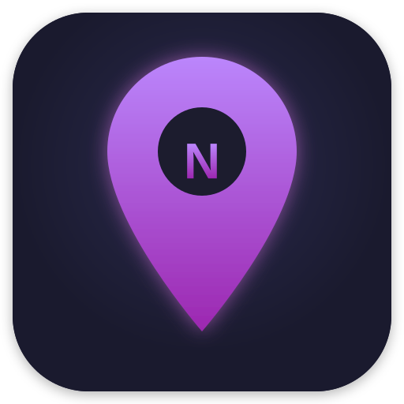

<p align="center">
  
</p>

<h1 align="center">NosnikLocate</h1>

<p align="center">
  <strong>Privacy-focused, real-time location sharing for the people you trust.</strong>
</p>

<p align="center">
  <a href="LICENSE"></a>
  
  
  
</p>

---

## About

NosnikLocate is a **free and open-source** mobile application that lets you share your real-time location with friends and family — on your own terms. Built with privacy as a first-class citizen, NosnikLocate never sells your data to third parties and gives you full control over who sees your location.

## Features

- **Real-time Location Sharing** — See where your friends are on a live map
- **Friend System** — Send, accept, and manage friend requests
- **Privacy Controls** — Toggle location sharing on/off at any time
- **OpenStreetMap** — Uses free, open map data — no Google dependency
- **Self-Hosted Backend** — Run your own server; your data stays yours
- **Cross-Platform** — Android, iOS, and desktop from a single Qt/C++ codebase
- **Modern UI** — Clean, dark-themed QML interface with purple accents
- **Secure** — Bcrypt password hashing, JWT auth, HTTPS, rate limiting

## Screenshots

> *Screenshots coming soon — the app is under active development.*

| Map View | Friends List | Profile |
|----------|-------------|---------|
|  |  |  |

## Tech Stack

| Layer | Technology | License |
|-------|-----------|---------|
| **Mobile App** | Qt 6, C++17, QML | LGPLv3 |
| **Maps** | OpenStreetMap / Mapbox GL | ODbL |
| **API Server** | Node.js, Express | MIT |
| **Database** | PostgreSQL 15+ | PostgreSQL License |
| **Geospatial** | PostGIS | GPLv2 |
| **Caching** | Redis | BSD |
| **Reverse Proxy** | Nginx | BSD-2-Clause |

## Architecture

```
┌─────────────────────────────────────────────────────────┐
│                    NosnikLocate App                      │
│              (Qt 6 / C++ / QML)                         │
│                                                         │
│  ┌──────────┐  ┌──────────────┐  ┌───────────────────┐ │
│  │  Map View │  │ Friends List │  │  Profile/Settings │ │
│  └────┬─────┘  └──────┬───────┘  └────────┬──────────┘ │
│       └───────────────┼────────────────────┘            │
│                       │ HTTPS                           │
└───────────────────────┼─────────────────────────────────┘
                        │
                        ▼
┌───────────────────────────────────────────────────────┐
│                  Nginx (Reverse Proxy)                 │
│              SSL / Rate Limiting / Headers             │
└───────────────────────┬───────────────────────────────┘
                        │
                        ▼
┌───────────────────────────────────────────────────────┐
│               Node.js + Express API                   │
│         JWT Auth │ Validation │ Rate Limiting          │
└──────────┬────────────────────────────┬───────────────┘
           │                            │
           ▼                            ▼
┌─────────────────────┐    ┌────────────────────────┐
│  PostgreSQL + PostGIS│    │        Redis            │
│  Users, Locations,   │    │   Sessions / Cache      │
│  Friendships         │    │                         │
└──────────────────────┘    └─────────────────────────┘
```

## Quick Start

### Prerequisites

- **Qt 6.5+** with Qt Quick / QML modules
- **CMake 3.16+**
- **C++17** compatible compiler
- **Android SDK/NDK** (for Android builds)

### Building the App

```bash
# Clone the repository
git clone https://github.com/Nosniktaj/NosnikLocate.git
cd NosnikLocate

# Configure with CMake
cmake -B build -DCMAKE_BUILD_TYPE=Release

# Build
cmake --build build --parallel

# Run (desktop)
./build/NosnikLocate
```

### Building for Android

Open the project in **Qt Creator**, select an Android kit, and build. Alternatively:

```bash
cmake -B build-android \
  -DCMAKE_TOOLCHAIN_FILE=$ANDROID_NDK/build/cmake/android.toolchain.cmake \
  -DANDROID_ABI=arm64-v8a \
  -DQT_HOST_PATH=/path/to/qt/gcc_64

cmake --build build-android --parallel
```

## Server Setup

The backend server runs on Node.js with PostgreSQL/PostGIS. For complete setup instructions, see:

📖 **[SERVER_SETUP.md](SERVER_SETUP.md)** — Full guide covering PostgreSQL, PostGIS, Redis, Nginx, SSL, systemd, backups, and more.

Quick overview of the server:

```bash
cd server
cp .env.example .env    # Edit with your config
npm install
npm start               # Starts on port 3000
```

## Privacy

NosnikLocate is built with privacy as a core principle:

- 🔒 **Your data, your server** — Self-host the backend; no one else has access
- 🚫 **No data sales** — We will never sell or share your data with third parties
- 👁️ **You control visibility** — Toggle location sharing on/off at any time
- 🗑️ **Right to delete** — Delete your account and all associated data instantly
- 📍 **Friends only** — Location is only visible to accepted friends with sharing enabled
- 🔐 **Encrypted in transit** — All communication over HTTPS with TLS
- 🧂 **Hashed passwords** — Bcrypt with cost factor 12; we never store plaintext passwords

## Contributing

Contributions are welcome! Here's how to get started:

1. **Fork** the repository
2. **Create a branch** for your feature or fix (`git checkout -b feature/my-feature`)
3. **Commit** your changes with clear messages
4. **Push** to your fork and open a **Pull Request**

Please ensure your code:
- Follows the existing code style
- Includes appropriate documentation
- Does not introduce unnecessary dependencies

For bug reports and feature requests, please [open an issue](https://github.com/Nosniktaj/NosnikLocate/issues).

## License

NosnikLocate is licensed under the **GNU Lesser General Public License v3.0**.

See [LICENSE](LICENSE) for the full license text.

```
NosnikLocate - A privacy-focused location sharing application
Copyright (C) 2024 Nosniktaj

This program is free software: you can redistribute it and/or modify
it under the terms of the GNU Lesser General Public License as published by
the Free Software Foundation, either version 3 of the License, or
(at your option) any later version.
```

## Acknowledgements

- [Qt Project](https://www.qt.io/) — Cross-platform application framework
- [OpenStreetMap](https://www.openstreetmap.org/) — Free, editable map data
- [PostGIS](https://postgis.net/) — Spatial database extender for PostgreSQL
- [Express](https://expressjs.com/) — Fast, minimal Node.js web framework

---

<p align="center">
  Made with 💜 by <a href="https://github.com/Nosniktaj"><strong>Nosniktaj</strong></a>
</p>